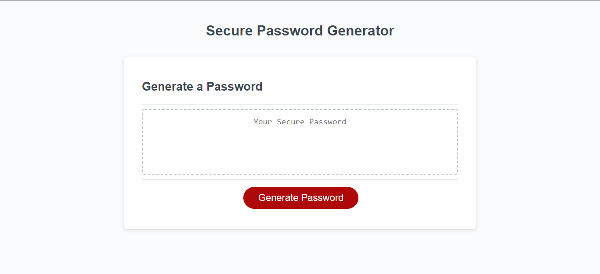
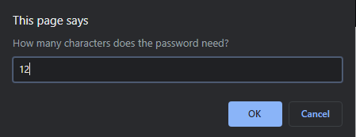
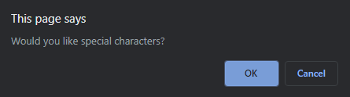
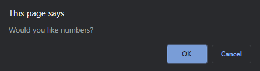
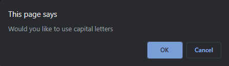

# Secure Password Generator in Javascrpit
> In this project, I am working through javascript to create a secure password generator so that I can always be secure when creating a password and use a different password for each account. 

## Basics of the project
It is hard to come with a secure password for the inevitable account requirements for everything from Facebook to ones online banking. This password generator allows for a new and random password every time. By selecting a few criteria, the password generator can generate a password for your preferences or the account you are creatings needs. By using arrays and other functions, with a little bit of math, a new password is created just for you! Best part, none of the passwords are ever saved so they can not be seen by anyone but you during the time you generate the password. 

## Screenshots
 
Password Generator Homepage
 
First prompt for Password length
 
Confirming if you want special characters in your password
 
Confirming if you want numbers in your password
 
Confirming if you want capital letters in your password

## Technologies
* HTML - version 5.0
* CSS - version 4.0
* Javascript - version 9.0

## How to use
Go to [Deployed Application](https://ProgHarrison234.github.io/javascript-password-generator)

## Inspiration
We all need secure passwords for the account life used today. Why not a random password generator? 

## Contact
Created by [@ProgHarrison234](https://www.github/ProgHarrison234) - feel free to contact me!